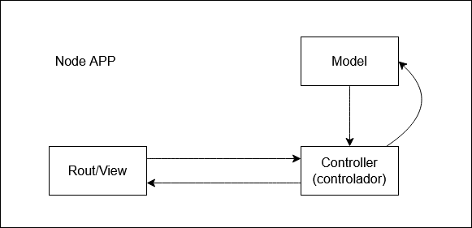

# Introdução
- Aplicar arquitetura MVC (Model-View-Controller) na aplicação.
- Refatorar o código.
    > Processo de reestruturar e otimizar o código-fonte de um software, sem alterar o seu comportamento externo

## Arquivo ENV
- Não é interessante deixar o drive de conexão do banco de dados diretamente no código. Dessa forma, cria-se o arquivo `.env`
- Nesse arquivo, temos que instalar uma biblioteca do Node para acessar as variáveis nesse documento .env.
    - No site de npm, procura-se por `DOTENV`
    - No terminal: `npm i dotenv`
- No arquivo `server.js`:
1. Incluir o `dotenv`
    - Na documentação no site npm (incluir no começo do documento):
        ~~~javascript
         require('dotenv').config();
        ~~~
    > Permite acesso aos aquivos `.env`
2. Variável para armazenar uma variável do arquivo `.env`:
    ~~~javascript
        const MONGO_URL = process.env.MONGO_URL;
    ~~~
3. Essa variável passa ser requisitada no método `.connect()`
4. Fazer o mesmo com a porta onde está rodando a aplicação (PORT)

## Arquitetura MVC
- O MVC é um padrão de arquitetura de software que divide uma aplicação em três componentes principais:
    1. **Model (Modelo):** Representa os dados da aplicação, sua lógica e regras de negócio. Ele não se preocupa com a forma como os dados são exibidos ou manipulados, apenas com a sua estrutura e funcionalidades.

    2. **View (Visão):** É a camada de apresentação, responsável pela interface com o usuário. Ela exibe as informações ao usuário e geralmente interage com o modelo para obter os dados a serem mostrados.

    3. **Controller (Controlador):** Atua como intermediário entre o modelo e a visão. Recebe as entradas do usuário na interface (como cliques em botões ou formulários) e atualiza o modelo de acordo. Ele também pode atualizar a visão com base nas mudanças no modelo.
 
- Permite que diferentes partes da aplicação sejam alteradas independentemente umas das outras.

- No momento, ao desenvolver o back-end, é focado mais em nas rotas (routes) do que na visão (view).
- Assim, inicia-se pela criação da pasta(package) de rotas (routes)
    - Nessa pasta, temos o arquivo `rotasProduto.js` onde concentram-se todas as rotas.